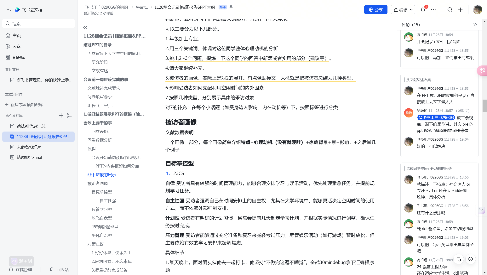
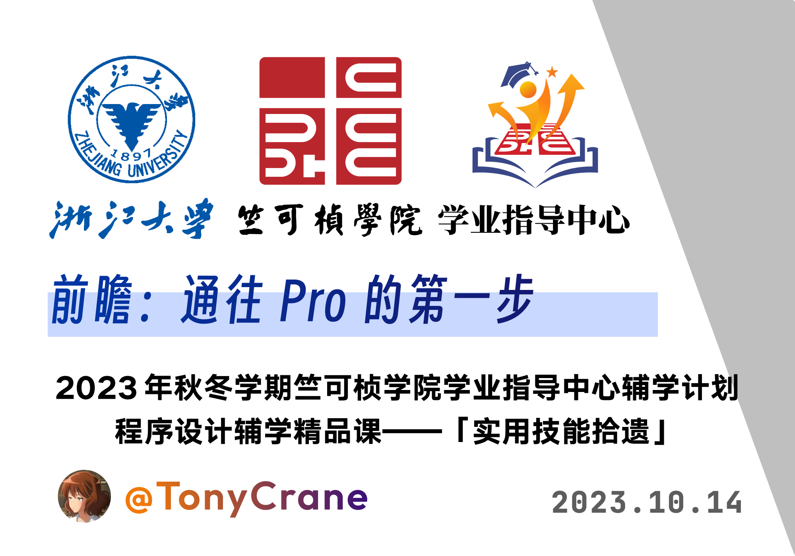

<!-- .slide: data-background="cov1.png" data-background-size="contain" -->

<!--s-->
<!-- .slide: data-background="lec0/background.png" -->

# Part.1 研究阶段

<!--v-->
<!-- .slide: data-background="lec0/background.png" -->

## 研究时间轴

- 线上问卷设计
    - 问卷分发
    - 数据分析
- 开题报告
- 4次(?)组会
- 文献综述撰写
    - 确定文献检索的3个角度
        - 心理学&脑科学
        - 社会背景e.g.内卷&优绩主义
        - 家庭背景e.g.籍贯&家庭经济状况
    - 文献搜集
    - 文献总结
- 线下访谈
    - 访谈问题设计
    - 访谈
    - 访谈材料的**归类分析**
- 结题展示&报告撰写

<!--v-->
<!-- .slide: data-background="lec0/background.png" -->

## 时间安排(或者这个形式)

|研究步骤|日期|人员|
|:--|:--|:--|
|线上问卷设计|10.14（秋四周）|组会人员|
|文献综述撰写|11.9-11.15|a,b,c..|
|线下访谈|11.15-11.22|xxx...|

<!--s-->
<!-- .slide: data-background="lec1/background.png" -->

# Part.2 文献综述

<!--v-->
<!-- .slide: data-background="lec0/background.png" -->

## 社会背景 - 内卷的成因与机制

- 优绩主义评价体系的单一性：内卷的根本成因在于社会对“优绩”的单一评价标准，导致个体为了适应这一评价体系而选择趋同的路径，最终陷入竞争的恶性循环。现代社会中，尤其在教育领域，存在着单一的成功标准（如成绩、排名等），这种优绩主义的背景使得学生在面对相同的目标时，采取了相似甚至重复的努力方式，形成了内卷的现象。
- 张庆锐提出，现代社会中，大学生面临着外部环境对成绩的极高要求，内卷是优绩主义评价体系的直接结果，学生在这种体系下的行为选择趋向单一且同质化，缺乏真正的创新和自主性。

<!--v-->
<!-- .slide: data-background="lec0/background.png" -->

## 社会背景 - "自由"地选择自我剥削

- 优绩主义教育强调个人奋斗与努力的重要性，鼓励学生不断追求精英化的目标。学生在这一框架下被激励争取更高的成绩和更好的职位。学生被不断告知努力和成就之间的关系，努力成为实现成功的唯一途径。
- 然而，这种模式在表面上赋予学生自由的选择权，实际上却导致了一种“自由”的错觉。学生在追求优绩的过程中，虽然看似是在为自我发展而努力，实际上却陷入了一个不断增加压力的循环中。学生的努力不仅没有带来预期的自由，反而被过度的工作负荷束缚，最终走向过劳与倦怠。
- 现代社会特别是数字资本主义背景下，劳动的剥削形式逐渐从强制性转变为诱导性。个体在追求优绩的过程中，主动选择了过度劳动，形成自我剥削的恶性循环，表现为“自我压榨”和“自我异化”。

<!--v-->
<!-- .slide: data-background="lec1/background.png" -->

## 社会背景 - 逃避劳动与“反劳动”

- 面对内卷的无效性和过度劳动的消耗，一部分学生通过逃避劳动来对抗这种无望的局面。他们通过建立“反劳动”的心态来解构传统的劳动价值观，出现了对劳动和奋斗的轻视，表现为“躺平”文化、低消费、无欲无求、慢就业等生活态度的兴起。
- 这种“反劳动”的心态本质上是对过度劳动和内卷的反应。学生通过降低期望值、淡化对成绩的追求，试图摆脱内卷带来的负面影响，但这种态度往往无法彻底解决内卷的根本问题，而只是提供了一种短期的心理缓解。

<!--v-->
<!-- .slide: data-background="lec1/background.png" -->

## 劳动异化的发生逻辑与心理动机
1. **思维定势的影响**
- 内卷不仅是外部环境的压力，也与个体的思维定势密切相关。很多学生从高中到大学，仍然延续着“成绩至上”的思维方式，把所有努力的价值和意义都寄托在成绩和外部的评价上，导致在面对大学生活的多元性和不确定性时感到迷茫和焦虑。
2. **目标迷失导致的劳动两极化**
- 当学生无法在大学找到清晰的目标和方向时，往往陷入两种极端：要么盲目追求成绩和“拼搏”式的过度劳动，要么逃避劳动，形成“反劳动”的态度。这两者都反映了劳动异化的发生过程，即个体无法从自身的内在需求出发，而是被外部的评价体系和社会期望所主导。

<!--v-->
<!-- .slide: data-background="lec1/background.png" -->

## 社会背景角度

- 优绩主义文献

<!--v-->
<!-- .slide: data-background="lec1/background.png" -->

## 社会背景角度 - 优绩主义文献

<!--v-->
<!-- .slide: data-background="lec1/background.png" -->

## Personal - 个人背景 - 家庭

- 插入文献

<!--v-->
<!-- .slide: data-background="lec1/background.png" -->

## Personal - 个人背景 - 籍贯  

<!--v-->
<!-- .slide: data-background="lec1/background.png" -->

## 心理学研究 - 利用眼动仪

- 什么是眼动仪?
- 插入文献
- 插入图片

<!--v-->
<!-- .slide: data-background="lec1/background.png" -->

## 心理学研究 - 文献 

- 插入文献

<!--s-->
<!-- .slide: data-background="lec2/background.png" -->

# Part.3 线上问卷分析

<!--v-->
<!-- .slide: data-background="lec0/background.png" -->

## 调查结果 - 可视化

- 插入饼状图 图片

<!--v-->
<!-- .slide: data-background="lec0/background.png" -->

## 显示的规律

1. 心理健康和假期安排的关系：
  - 大多数学生认为当前的假期安排对他们的心理健康有“比较积极”的影响（39人），尽管有一定的压力但整体感觉不错。
  - 22人认为影响“一般”，12人感到“比较消极”，偶尔感到压力和焦虑，只有1人认为影响“非常消极”。
2. 理想中的假期安排?
  - 学生理想中的假期安排多种多样，但普遍包括“完全休息，放松身心”、“学习新技能或知识”、“旅行或探索新地方”和“从事个人爱好”。
  - 最受欢迎的组合是“完全休息，放松身心”加上其他活动，如学习新技能、旅行、或自我探索与反思，这表明学生希望在假期中既能放松又能有所收获。

<!--s-->
<!-- .slide: data-background="lec2/background.png" -->

# Part.4 线下访谈 - 5种画像

<!--v-->
<!-- .slide: data-background="lec2/background.png" -->

## 5 Portrait

- 目标掌控型
    - 目标明确，自我要求高，自主性强
- 只管学习型
    - 专注于学业，对其他活动不感兴趣
- 放飞自我型
    - 乐观开朗，自由自在，不受外界影响
- 45度角型
    - 保持平衡，不过度追求
- 平凡自洽型
    - 乐观平和，对生活有自己的看法

<!--v-->
<!-- .slide: data-background="lec2/background.png" -->

## 目标掌控型 - 动机之源

1. 教育背景：来自顶级高中，考入Top3名校
    - 有很强的能力和竞争意识。高中时期可能经历了较大的压力和竞争
    - 高效的时间管理和自我调节来应对学业挑战。
    - 习惯在高压力的环境下高效运作，因此他对空闲时间的安排表现出较强的控制感。
    - 在大学中，他仍然保持着高效、目标导向的时间管理方式，确保能够平衡学业与娱乐
2. 自律
    - 早期(高中等)就养成了高效利用时间的习惯
    - 他认为自己的学业和生活是可以控制的，因此他会尽量避免不必要的浪费时间的行为，保持高效率。   

<!--v-->
<!-- .slide: data-background="lec2/background.png" -->

## 目标掌控 - Details

1. 23级 CS
    - 对"如何减轻压力感"回答：理性分析
        - 打游戏充其量只能麻痹一下
        - 真正减轻压力是充分复习，提前2周左右开始刷题，准备等
    - 某天晚上，朋友催他去一起打卡，他坚持“不做完这题不睡觉”，奋战30min拿下汇编程序题
2. 23级 信工
    - **学习娱乐两手抓**
    - 受访者一手抓朋友圈、一手抓团建、一手抓绩点、一手抓上课、一手抓自习
    - **主动规划**
    - 受访者使用计划工具（求是潮手机站、滴答清单等）、设定短期和长期目标
    - **追求劳逸结合**
    - 受访者的一个目标是希望做到学业、体锻、社交等多方面的平衡。     

<!--v-->
<!-- .slide: data-background="lec0/background.png" -->

## 画像 - Summary

  1. 目标明确，规划性强
  - 有明确的长短期目标，并通过有意识的时间管理来逐步实现这些目标。他们通过每周的学习任务安排来确保自己在学术上的持续进步，合理安排放松和娱乐活动，以此保持身心的平衡和长期目标的达成。
  2. 自主性与控制感
  - 根据自己的需求和任务优先级自主调整时间和活动安排。
  - 根据学业任务的紧迫程度灵活调整计划。
  3. 内卷应对策略
  - 合理的时间管理和复习策略来应对学业压力。目标掌控者通- 通过提前复习、合理分配学习任务时间来减轻内卷带来的焦虑，并选择适当的放松方式来应对压力。
  4. 舒适感与心理自洽好地应对学业压力。
  5. 社会文化影响与个体选择

<!--v-->
<!-- .slide: data-background="lec2/background.png" -->

## 只管学习型 - 动机之源

1. 教育背景：来自相对普通高中，考入名校
    - 高中时期可能经历了较大的压力和竞争
    - 习惯高中思维，优绩主义，高压力的环境下高效运作，因此他对空闲时间的安排表现出较强的控制感。
    - 平衡学业与娱乐
2. 家庭背景- 专注学业
    - 社交，其他兴趣爱好较少   

<!--v-->
<!-- .slide: data-background="lec2/background.png" -->

## 只管学习型 - Details

1. 24级 自动化
    - 作为大一的学生，受访者已展现出较强的独立性，能够主动安排学习和活动，同时也具备一定的计划性，虽然目前实施上仍需改进。此外，他也能自觉地意识到学习与个人发展的平衡。
    - 爱好广泛，但学习压力较大，课业繁重
    - 深知个人对很多爱好都是三分钟热度，倾向用学习填充空闲时间以减少焦虑。
2. 24级 CS
    - 平时周末基本都在自习室，社交范围较小，学业的投入较高
    - 没有参加社团，学生组织
    - 学习之外基本只有打游戏，羽毛球等活动

<!--v-->
<!-- .slide: data-background="lec2/background.png" -->

## 放飞自我型 - 动机之源

1. 教育背景：来自相对严格高中，比较衡水
    - 高中时期管理较严格，他律主导
    - 大学无严格管理，心态反弹，追求自由自在的生活方式
2. 家庭背景- ?需要思考or chatgpt
    - 社交较多

<!--v-->
<!-- .slide: data-background="lec2/background.png" -->

## 放飞自我型 - Details

1. 24级 自动化 山东
    - 看上去没有ddl的样子
    - 每天似乎都有1h+的空闲时间... 
    - 无计划
    - 想到什么做什么，以至于~~有两次开会都迟到了~~
2. 24级 CS 福建
    - 有时候晚上十点多被同学约去吃夜宵，欣然前往，甚至很晚才回宿舍
    - 自认为空闲时间比较"虚度光阴"，对时间管理有反思意识，但尚未有具体行动改进
    - 似乎每晚都可以有时间玩游戏,经常发出"现在干什么好呢?"的疑问

<!--v-->

## 放飞自我型 - 动机分析
- 1. 任务驱动：作业、组织任务等具体目标成为优先安排的核心依据。 
- 2. 倾向于即时满足，对时间规划和长期目标的意识较弱。
- 3. 时间安排受临时目标和外部因素e.g.同学邀约 影响较大,自我驱动能力和时间规划意识较弱
- 4. 存在一定的**缓冲心理**,认为任务较少,暂时对时间利用效率不够重视。

<!--v-->
<!-- .slide: data-background="lec2/background.png" -->

## 45度角型 - 动机之源

1. 教育背景：来自较著名高中，比较--
    - 高中时期自我要求高，他律主导
    - 大学机会，诱惑多，与有限精力时间冲突
2. 家庭背景- ?需要思考or chatgpt
    - 社交较多

<!--v-->
<!-- .slide: data-background="lec2/background.png" -->

## 45度角型 - Details

1. 23级 农资环 江西
    - 计划性高但执行力有限
    - 使用四象限法,规划优先级
    - 用日程表规划，但有时候被玩游戏破坏
    - 认为自己的时间利用效果"仍不太得当"，尤其是游戏等娱乐活动可能占据过多时间，影响学习效率。
    - 但基本能合理安排时间用于学习,实验室,云峰学综工作等
2. 24级 海洋工程与技术 杭二中
    - 组队活动时开始充满想法，但实际没有时间施行，最后不了了之
    - 五天早八,3个社团or组织，运动队副队长
    - 但处在高压下,每天内耗焦虑

<!--v-->

## 45度角型 - 动机分析
- 1. 心有余而力不足,想做1做2,实际可能只做了0.5 
- 2. 处在高压下，每天内耗焦虑
- 3. 借鉴同学的时间管理方法,希望通过挑战成长

<!--v-->
<!-- .slide: data-background="lec2/background.png" -->

## 平凡自洽型 - 动机之源

1. 教育背景：来自相对严格高中，比较衡水
    - 大学课业压力较重
2. 家庭背景- ?需要思考or chatgpt
    - 社交较多

<!--v-->
<!-- .slide: data-background="lec2/background.png" -->

## 平凡自洽型 - Details

1. 23级 园艺
    - 选择性出勤，让室友代为签到，理由是"某些课程教学质量有待提高，听课不必要"
    - 每月去西湖"什么都不做"，通过静坐放空缓解焦虑和压力，表现出对自我舒适的关注 
2. 24级 CS 福建
    - 有时候晚上十点多被同学约去吃夜宵，欣然前往，甚至很晚才回宿舍
    - 自认为空闲时间比较"虚度光阴"，对时间管理有反思意识，但尚未有具体行动改进
    - 似乎每晚都可以有时间玩游戏,经常发出"现在干什么好呢?"的疑问

<!--v-->

## 平凡自洽型 - 动机分析
- 1. 倾向于按个人需求而非社会期望安排时间。 
- 2. 自主性与舒适导向,生活节奏自主化,将"舒适"作为衡量标准，逐渐摆脱外界评价。
    - 通过游戏、健身等放松活动代替深层次自我提升
- 3. 个性选择:注重自我节奏,远离竞争核心,追求心理自洽
- 4. 批判内卷，但无法摆脱环境的影响，表现出被动应对

<!--s-->
<!-- .slide: data-background="lec2/background.png" -->

# Part.5 对策建议

<!--v-->
<!-- .slide: data-background="lec2/background.png" -->

## 做减法 

**明确目标，为自己减负**
- 明确自己想做什么，宁缺毋滥
- 删除并非一定要完成的任务或ddl e.g.非必要的社团or讲座
- 大学的选择有很多种,每种选择都可以获得美丽

<!--v-->
<!-- .slide: data-background="lec2/background.png" -->

## 找到自我 - 优秀学姐寄语

- 21级 保研学姐 分享建议

<!--v-->
<!-- .slide: data-background="lec2/background.png" -->

## 找到自我 - 优秀学姐寄语

<!--v-->
<!-- .slide: data-background="lec2/background.png" -->
## 善用计划方法

- 1. 四象限法（紧急/不紧急，重要/不重要）

<!--v-->
<!-- .slide: data-background="lec2/background.png" -->
## 善用计划方法

- 2. SMART原则(安排有效计划)
  - 具体的 (Specific)
  - 可以衡量的 (Measurable)
  - 可以达到的 (Attainable)
  - 相关性 (Relevant)
  - 明确的截止期限 (Time-bound)

  

<!--v-->
<!-- .slide: data-background="lec2/background.png" -->

## 提前完成,留出余量

- 今天布置的作业今天做完,即使ddl是一周后
- 如何选择?

 

<!--v-->
<!-- .slide: data-background="lec2/background.png" -->
## 情绪自洽 - 和解

- 关注个人情绪
    - 注意身体健康对情绪的影响
    - 学废了就去跑步or打球吧~
- 学习控制外界压力和社会期望对个人的影响
    - 真正关心你的人不会替你决定

<!--v-->
<!-- .slide: data-background="lec2/background.png" -->
## 寻求平衡

- 学业,娱乐,体育等都需考虑，最好不要顾此失彼
- 减少"假性休息"
    - 休息就好好睡觉or去自然中走一走
    - 刷视频 - 注意力黑洞,难以休息   

<!--v-->
<!-- .slide: data-background="lec2/background.png" -->
## 对优绩主义采取合适的态度

- 做 "分子" 时消极 看淡 以自谦
- 做 "分母" 时积极 进取 以自驱

- 人生在世，有了满足的“道”，又有不满足的“儒”
- 一道一儒，平衡调剂，不就是古人说的"儒道互补"?

<!--s-->
<!-- .slide: data-background="lec2/background.png" -->

# Part.6 感想 & 收获

<!--v-->
<!-- .slide: data-background="lec2/background.png" -->
## 会议效率之谜

- 群里9人,组会5人，积极讨论3人，如何解?
- 信息不对称,本地编辑合作难,一人打字, 全员观战? 

<!--v-->
<!-- .slide: data-background="lec2/background.png" -->
## 引入企业协作平台 - 飞书

- 飞书是一站式企业协作与管理平台，整合即时消息、会议、云文档功能
- 我们主要看中云文档&即时评论
- 合作编辑，支持markdown语法，所见即所得
- 上传图片,PPT,excel方便

<!--v-->
<!-- .slide: data-background="lec2/background.png" -->
## 先进企业管理经验 - 飞阅会

- 联想 影视飓风Tim 创业经验分享(10:26)

<iframe width="900" height="550" src="//player.bilibili.com/player.html?bvid=BV17u411E7UK" frameborder="0" allow="accelerometer; autoplay; encrypted-media; gyroscope; picture-in-picture" allowfullscreen></iframe>

<!--v-->
<!-- .slide: data-background="lec2/background.png" -->
## 飞阅会

- 静默阅读10min,以文本形式批注
    - 优点:强迫理清思路,集中讨论的问题
- 会议结束自然留下成型文档，便于后续整理    

<!--v-->
<!-- .slide: data-background="lec2/background.png" -->
## 会议实操效果

 

<!--v-->
<!-- .slide: data-background="lec2/background.png" -->
## Reveal-md 幻灯片

- PPT文本框重重叠叠,模板一改全乱，鼠标点不完，如何解?
- 启发来自 2023 秋冬学期竺可桢学院朋辈辅学「实用技能拾遗」课程

 

<!--v-->
<!-- .slide: data-background="lec2/background.png" -->
## Reveal-md 幻灯片

- 感谢TonyCrane学长
    - 21 级图灵班信息安全专业
    - 浙江大学 [AAA](https://zjusec.com/) 战队成员

 

<!--s-->
<!-- .slide: data-background="lec2/background.png" -->

# 谢谢大家

# Questions?

