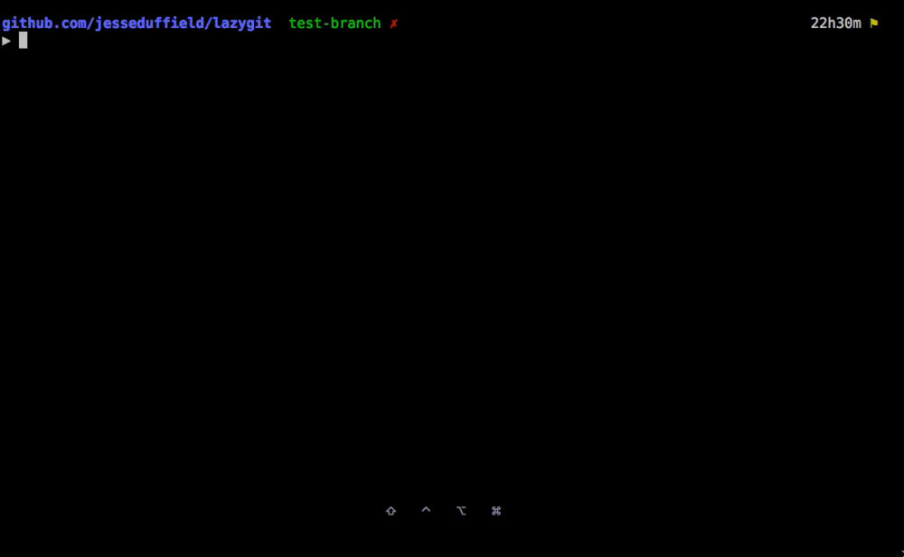
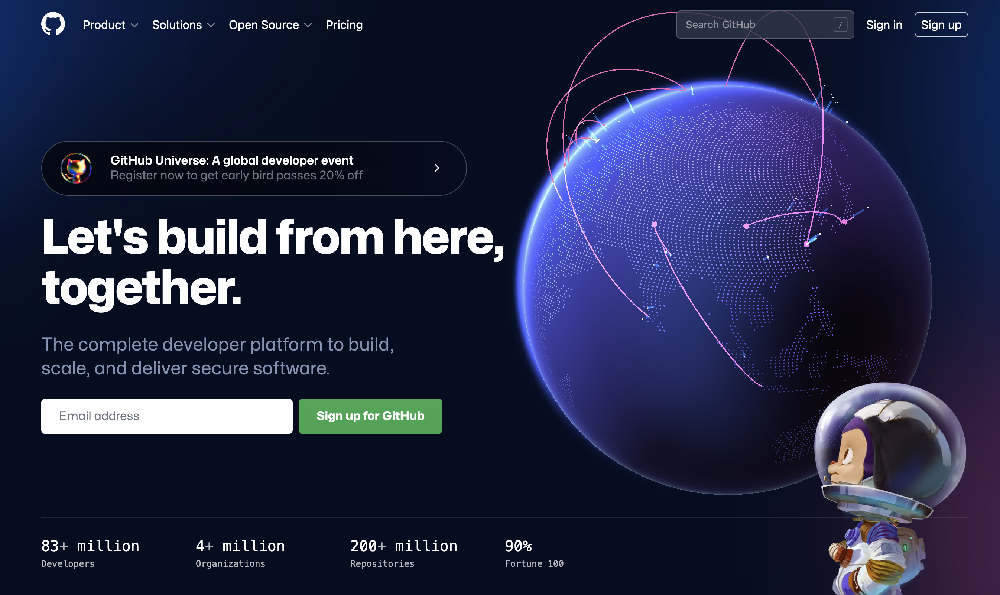

<!-- .slide: data-background="lec0/cover.png" -->


<!--s-->
<!-- .slide: data-background="lec0/background.png" -->

<div class="middle center">
<div style="width: 100%">

# Part.1 课程简介

</div>
</div>

<!--v-->
<!-- .slide: data-background="lec0/background.png" -->

## 关于讲师

- TonyCrane
    - 21 级图灵班信息安全专业
    - 浙江大学 [AAA](https://zjusec.com/) 战队成员
    - B 站知识区 up 主 [@鹤翔万里](https://space.bilibili.com/171431343)（绝赞停更中）
    - GitHub [@TonyCrane](https://github.com/TonyCrane)
    - 主页 https://tonycrane.cc/
    - 笔记 https://note.tonycrane.cc/
- 45gfg9
    - 22 级图灵班信息安全专业
    - 浙江大学 [AAA](https://zjusec.com/) 战队成员
    - GitHub [@45gfg9](https://github.com/45gfg9/)
    - 主页 https://45gfg9.net/

<!--v-->
<!-- .slide: data-background="lec0/background.png" -->

## 内容与时间安排

<div class="three-line">

|课程|日期|讲师|
|:--|:--|:--|
|lec0：前瞻：通往 Pro 的第一步|10.14（秋四周）|TonyCrane|
|lec1：Shell 基础及 CLI 工具推荐|10.22（秋五周）|45gfg9|
|lec2：Git/GitHub 及开源基础|11.05（秋七周）|TonyCrane|
|lec3：Markdown 语法及应用|11.19（冬一周）|TonyCrane|
|lec4：LaTeX 排版简要介绍|12.03（冬三周）|45gfg9|
|lec5：如何排出规范、美观的文档|12.17（冬五周）|TonyCrane|
|lec6：网络/网站基础知识概述|12.31（冬七周）|45gfg9|

</div>


<!--v-->
<!-- .slide: data-background="lec0/background.png" -->

## 资料与回放

- 课程仓库：[TonyCrane/PracticalSkillsTutorial](https://github.com/TonyCrane/PracticalSkillsTutorial)
- 课程主页：[slides.tonycrane.cc/PracticalSkillsTutorial](https://slides.tonycrane.cc/PracticalSkillsTutorial/)
- 本期课程主页：[*...*/2023-fall-ckc](https://slides.tonycrane.cc/PracticalSkillsTutorial/2023-fall-ckc/)
- 课程直播：B 站 [@鹤翔万里](https://live.bilibili.com/11896070)直播间（感谢竺院全媒体中心和学指的设备支持）
- 课程回放：当次课程结束后会上传至 B 站 [@鹤翔万里](https://space.bilibili.com/171431343)账号上


<!--s-->
<!-- .slide: data-background="lec1/background.png" -->

<div class="middle center">
<div style="width: 100%">

# Part.2 什么是 Shell？

</div>
</div>

<!--v-->
<!-- .slide: data-background="lec0/background.png" -->

## Terminal/Shell - 用命令行控制电脑

<div style="text-align: center;">

</div>


<!--v-->
<!-- .slide: data-background="lec1/background.png" -->

## 什么是 Terminal - 起源

> <span class="serif">"end point of a railway line," 1888, from terminal (adj.); **sense of "device for communicating with a computer" is first recorded 1954.** Earlier "final part of a word" (1831).</span>
>
> -- [在线语源学词典 (Online Etymology Dictionary)](https://www.etymonline.com/word/terminal)


- 早期计算机没有桌面环境，唯一的交互方式是键盘
- 用于输入数据，运行程序，并获得输出的“终端”

[图片来源：Gorthmog, CC BY-SA 4.0, Wikimedia](https://commons.wikimedia.org/wiki/File:DEC_VT100_terminal_transparent.png)

<!--v-->
<!-- .slide: data-background="lec1/background.png" -->

## 什么是 Terminal - 现今

- Terminal Emulator，模拟传统终端的行为
- 一个应用程序，提供了一个窗口，和输入输出交互的功能
- 内部运行的是 Shell，Shell 才是执行命令得到输出的东西

<div class="fragment">

都有什么常见的 Terminal 呢？

</div>

<div class="fragment">

- **Windows**：Windows Terminal（推荐）
- **Linux**：Gnome Terminal、Konsole、LXTerminal 等
- **macOS**：Terminal.app、iTerm2（推荐）等
- 跨平台：
    - [Alacritty](https://alacritty.org)：基于 Rust 开发
    - ...

</div>

<!--v-->
<!-- .slide: data-background="lec1/background.png" -->

## So what is a Shell?

- “壳层”，也是一个程序，是用户与系统内核交互的界面
- 负责接收并解析输入，交给更底层（操作系统）来执行，并返回输出

<div class="fragment">

都有什么常见的 Shell 呢？

</div>

<div class="fragment">

- Windows 下：cmd.exe、PowerShell 5
- \*nix 下：
    - **sh**：Bourne Shell，最早、最经典的 shell
    - **bash**：Bourne Again Shell，最常用的 shell
        - 大部分 Linux 发行版的默认 shell
    - **zsh**：Z Shell，功能强大、可高度自定义的 shell
        - macOS Catalina 起成为默认 shell
    - **fish**：Friendly Interactive Shell，开箱即用、全平台的 shell
    - <ruby>ash<rp>(</rp><rt>Almquist Shell</rt><rp>)</rp></ruby>, <ruby>csh<rp>(</rp><rt>C Shell</rt><rp>)</rp></ruby>, <ruby>ksh<rp>(</rp><rt>Korn Shell</rt><rp>)</rp></ruby>, nushell, <ruby>pwsh<rp>(</rp><rt>PowerShell 7</rt><rp>)</rp></ruby>, xonsh, ...
</div>


<!--v-->
<!-- .slide: data-background="lec1/background.png" -->

## Shell 与 Terminal

- Terminal 从用户获取输入，然后传递给 Shell，等待 Shell 处理完后，将结果再传递回用户（显示在屏幕上）
- Shell 从 Terminal 拿到输入指令，解析后交给操作系统执行，然后将结果返回给 Terminal


<!--v-->
<!-- .slide: data-background="lec1/background.png" -->

## 为什么要用命令行？它能做什么？

- 命令行也是一种操作计算机的方式，理论上可以做任何事情
- 可以让你手在键盘上就能控制电脑，而不需要鼠标点来点去
- 在没有显示器的机器上（例如通过 ssh 连接服务器），只能通过命令行操作

一个夸张的例子：你甚至可以在命令行中查看网页！[fathyb/carbonyl](https://github.com/fathyb/carbonyl)

<div style="text-align: center;">

</div>

Note: 不考虑 VNC 等远程桌面

<!--v-->
<!-- .slide: data-background="lec1/background.png" -->

## 为什么要用命令行？它能做什么？

别再用 Dev-C++ 写程序了，尽早使用 VSCode 与命令行 gcc

```shell
$ cat a.c
#include <stdio.h>
int main(void) {
  puts("Hello world!");
}

$ gcc a.c -o a

$ ./a
Hello world!
```

建议熟读并背诵：《谈谈如何让自己看上去、闻上去都像一个 CS 人》[CC98](https://www.cc98.org/topic/5370849) / [知乎专栏](https://zhuanlan.zhihu.com/p/539692975)

<!--v-->
<!-- .slide: data-background="lec1/background.png" -->

## \* 关于 zsh 的一些推荐配置

- oh-my-zsh：<https://ohmyz.sh>，一个 zsh 的配置框架，支持主题、插件等配置
<blockquote class="serif">Oh My Zsh will not make you a 10x developer...but you may feel like one!</blockquote>
- Powerlevel10k（p10k）：一个 oh-my-zsh 的主题，配置简单，美观
- 插件：
    - git：oh-my-zsh 自带插件，提供 git 相关的自动补全与 alias
    - sudo：oh-my-zsh 自带插件，按两次 Esc 自动添加 sudo
    - z：oh-my-zsh 自带插件，快速跳转到曾经跳转过的目录
    - zsh-autosuggestions：自动提示输入过的历史命令
    - zsh-syntax-highlighting：命令语法高亮
    - ...

具体安装方法等可参考：<https://note.tonycrane.cc/cs/tools/shell/>

<!--s-->
<!-- .slide: data-background="lec2/background.png" -->

<div class="middle center">
<div style="width: 100%">

# Part.3 什么是 Git/Github？

</div>
</div>

<!--v-->
<!-- .slide: data-background="lec0/background.png" -->

## Git - 版本控制工具

<div style="text-align: center;">

<p style="margin-top: 0.1em;">lazygit</p>
</div>


<!--v-->
<!-- .slide: data-background="lec0/background.png" -->

## 什么是 Git？

- 分布式版本控制系统（DVCS，Distributed Version Control System）
    - 分布式：不需要联网，在自己的机器上就可以使用
    - 版本控制：记录、管理、回溯文件的修改历史
- 历史？
    - Linus Torvalds 在开发 Linux 内核时由于当时使用的分布式版本控制系统 BitKeeper 对于免费版本加入了限制，于是开发了一款免费自由而且解决了历代 VCS 缺陷的版本控制系统 Git

<div style="text-align: center;">

</div>

<!--v-->
<!-- .slide: data-background="lec2/background.png" -->

## Git 模型

<div style="text-align: center;">

</div>

<p style="font-size: 0.5em; opacity: 0.7;">
本 slides 中所有图片均使用 excalidraw 原创绘制，转载请注明来源
</p>

<!--v-->
<!-- .slide: data-background="lec2/background.png" -->

## Git 基础配置

- 创建一个本地 git 版本库
    - 通过 git init 指令
        - git init：让当前文件夹变成 git 仓库（创建 .git 文件夹）
        - git init *folder*：创建一个新的文件夹并初始化为 git 仓库
- git 账号配置
    - Why？多人合作区分用户/让 GitHub 能够识别出你
    - 全局配置：
        - git config --global user.name "*name*"
        - git config --global user.email "*email*"
    - 针对某一版本库专门设置：
        - 同前，不加 --global

<!--v-->
<!-- .slide: data-background="lec0/background.png" -->

## GitHub - 全球最大的代码托管网站

<div style="text-align: center;">

</div>

<!--v-->

## GitHub 基本用法实操

- 新建 repo，基本设置
- 添加代码：
    - 从头开始的空项目：直接 clone
    - 从本地非 git 项目上传：init 后修改 remote
    - 修改、add、commit、push
- 分支、合并：branch / GitHub 上操作
- release：扩展的打 tag
- 小组项目合作：协作者、私有 repo 权限管理
    - pull request、merge、conflict 处理        


